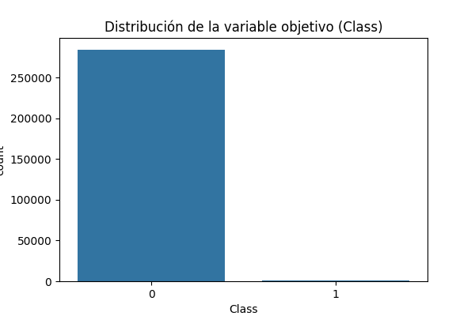
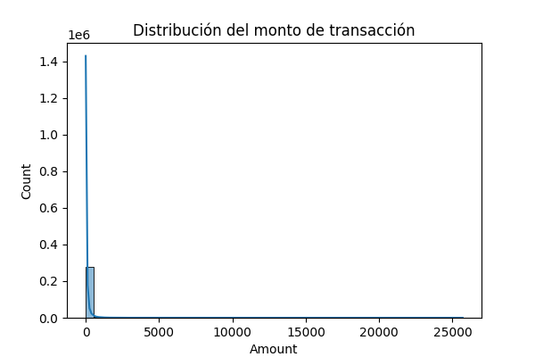
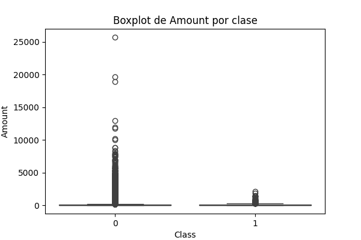

# Project Charter - Entendimiento del Negocio

## Nombre del Proyecto

**Detección de Fraude en Tarjetas de Crédito usando Machine Learning**

## Objetivo del Proyecto

Desarrollar un modelo de clasificación binaria capaz de identificar transacciones fraudulentas en tarjetas de crédito, utilizando técnicas de machine learning y siguiendo la metodología Team Data Science Process (TDSP).

## Alcance y Justificación

El fraude en tarjetas de crédito representa pérdidas significativas para instituciones financieras y usuarios. Un sistema automatizado de detección temprana puede reducir riesgos y costos, mejorando la seguridad y confianza en los sistemas de pago.

## Descripción del Dataset

- **Fuente:** [Kaggle - Credit Card Fraud Detection](https://www.kaggle.com/datasets/mlg-ulb/creditcardfraud)
- **Observaciones:** 284,807 transacciones
- **Variables:** 30 (28 variables anónimas, Amount y Time)
- **Variable objetivo:** `Class` (0 = No Fraude, 1 = Fraude)
- **Desbalance:** Solo 0.17% de las transacciones son fraudulentas

## Análisis Exploratorio Inicial

- **Distribución de la variable objetivo:**
  
- **Distribución del monto de transacción:**
  
- **Matriz de correlación:**
  
- **Boxplot de Amount por clase:**
  

- **Estadísticas descriptivas:** Ver archivo [creditcard_describe.csv](../../outputs/creditcard_describe.csv)

## Equipo del Proyecto
- Hernando Castro Arana
- Nicolas Amado Aristizabal
- Diego Alejandro Feliciano Ramos

## Cronograma Sugerido
| Etapa | Duración Estimada |
|-------|-------------------|
| Entendimiento del negocio y carga de datos | 1 semana |
| Preprocesamiento y análisis exploratorio | 2 semanas |
| Modelamiento y extracción de características | 2 semanas |
| Despliegue | 1 semana |
| Evaluación y entrega final | 1 semana |

## Presupuesto y Stakeholders
- Presupuesto estimado: **25 USD**
- **Stakeholders:**
  - Profesor(a) del curso: Responsable de la evaluación y seguimiento del proyecto.
  - Estudiantes del equipo: Responsables de la ejecución y entrega del proyecto.
  - Universidad Nacional de Colombia: Institución que provee el contexto académico y los recursos.
  - Usuarios simulados: Representan a los clientes de una entidad financiera ficticia, interesados en la seguridad de sus transacciones.

## Aprobaciones
- Nicolas Amado Aristizabal