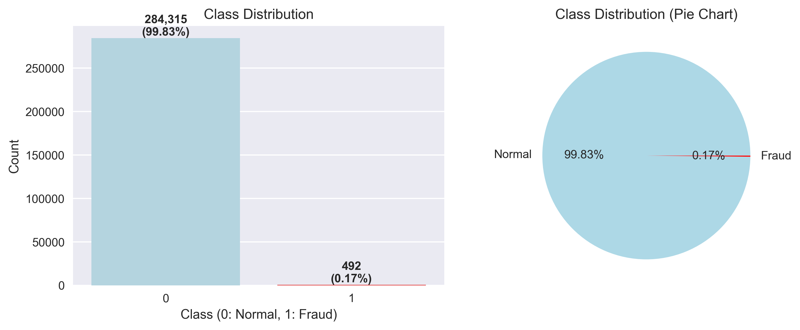
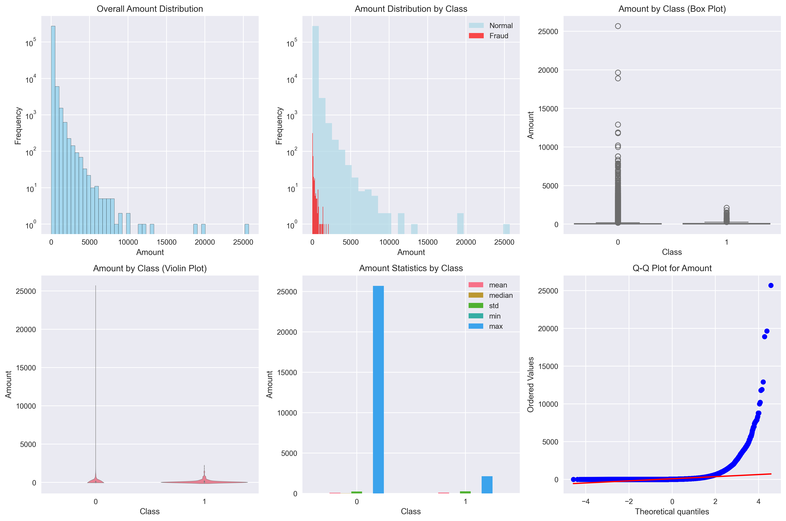
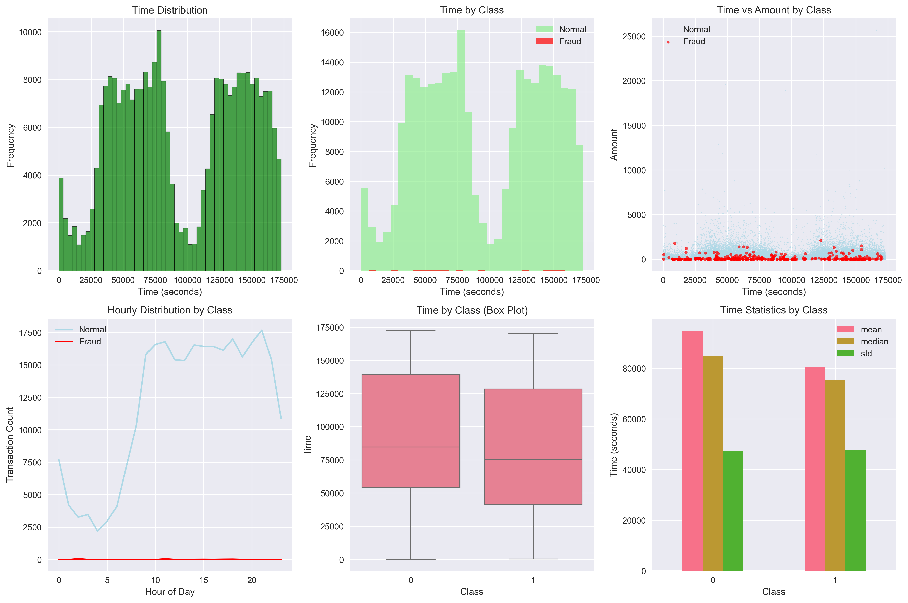
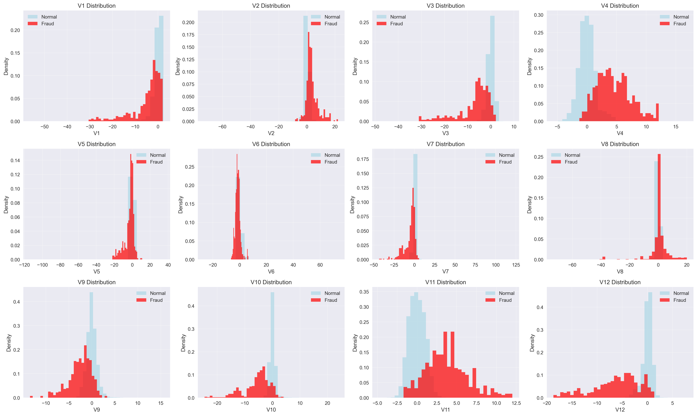
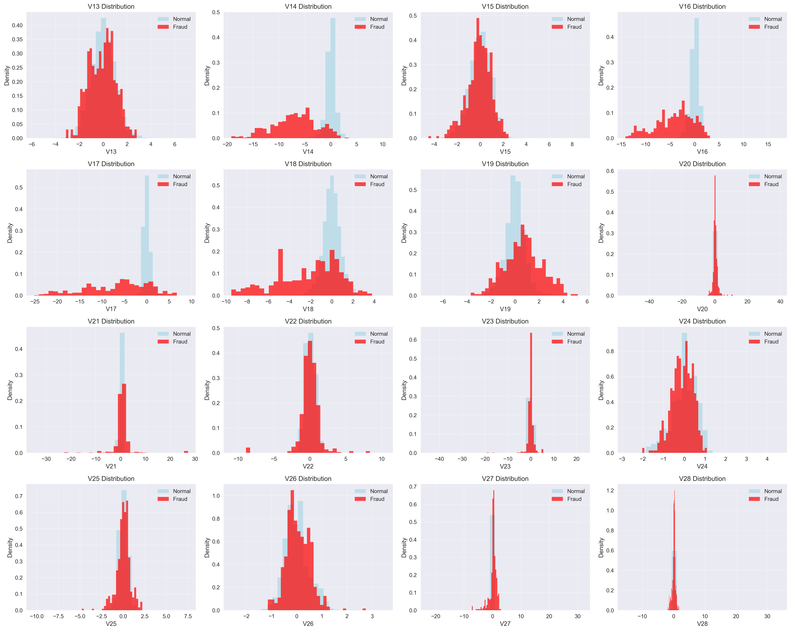
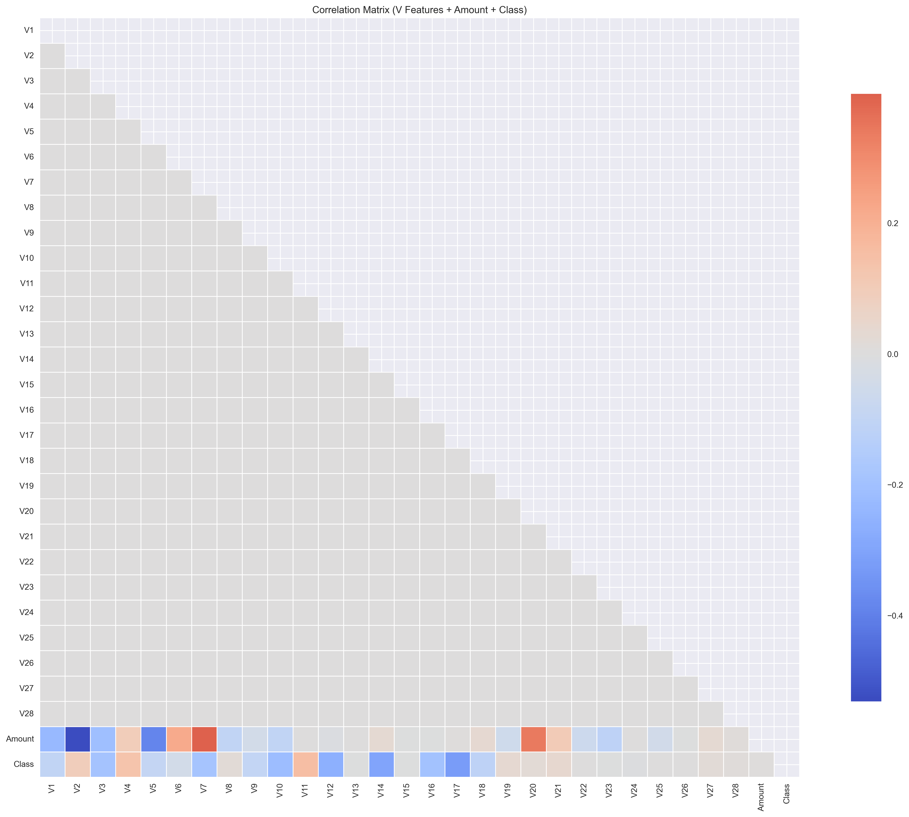
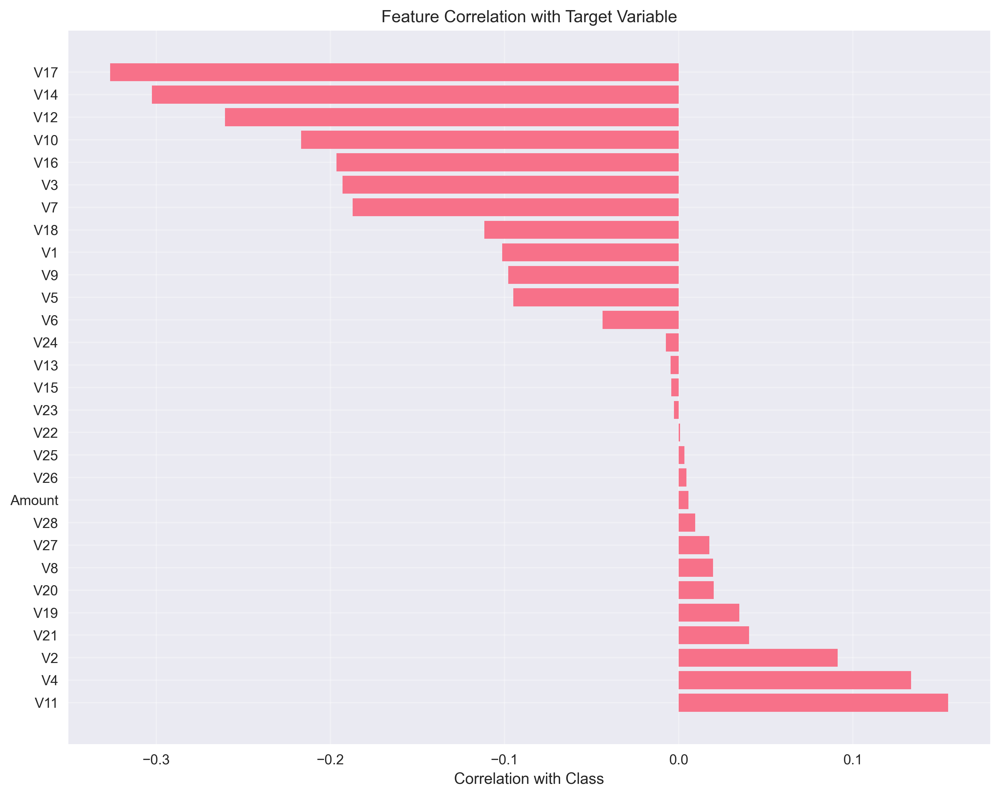
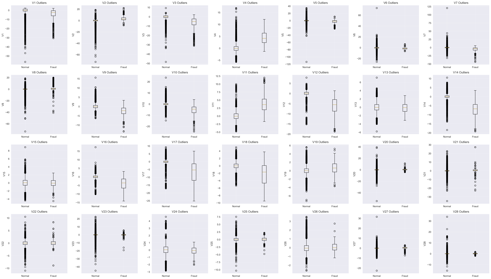
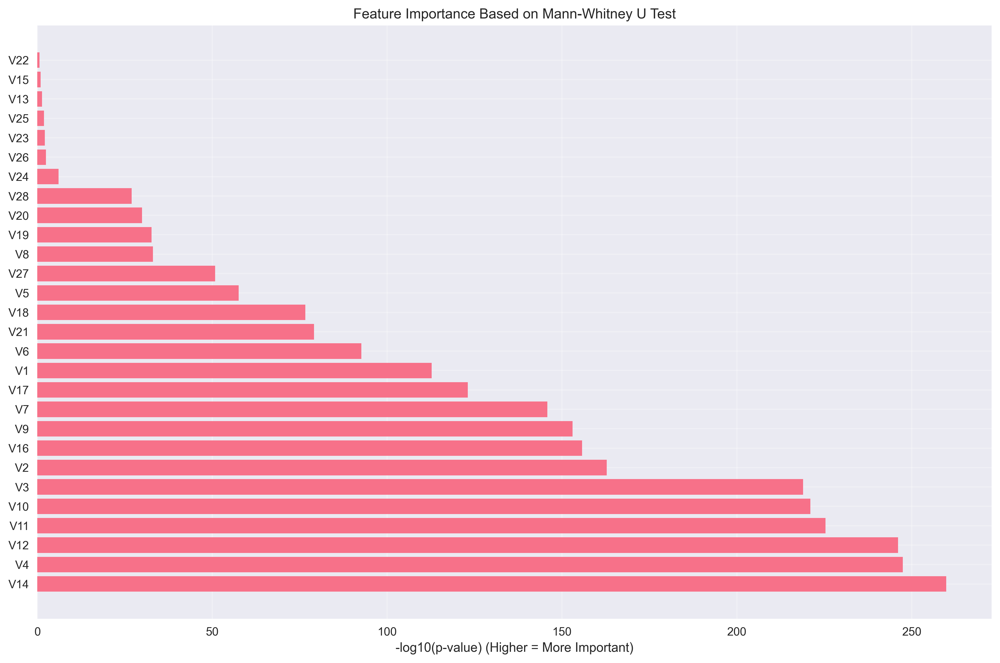

# Fase 2: Preprocesamiento y Análisis Exploratorio Avanzado

## Resumen Ejecutivo

Esta fase incluye el preprocesamiento completo de los datos y el análisis exploratorio avanzado para el proyecto de detección de fraude en tarjetas de crédito. Se han aplicado técnicas de balanceo de clases, estandarización de variables y análisis detallado de la calidad de los datos.

## 1. Código de Preprocesamiento

### Scripts Utilizados
- **`scripts/preprocessing/preprocess_data.py`**: Script principal de preprocesamiento
- **`scripts/eda/save_eda_images.py`**: Generación de visualizaciones básicas
- **`scripts/eda/generate_data_dictionary.py`**: Creación del diccionario de datos
- **`scripts/eda/generate_data_summary.py`**: Resumen estadístico
- **`scripts/eda/generate_profile_report.py`**: Reporte exploratorio con ydata-profiling

### Proceso de Preprocesamiento Aplicado

#### 1.1 División de Datos
- **Método**: Train-test split estratificado
- **Proporción**: 80% train, 20 **Estratificación**: Mantiene proporción de clases
- **Resultado**: 
  - Train set: 227,845 transacciones
  - Test set: 56,962ransacciones

#### 1.2Estandarización de Variables
- **Método**: StandardScaler (Z-score normalization)
- **Aplicado a**: Todas las variables numéricas
- **Propósito**: Normalizar escalas para algoritmos de ML
- **Archivo guardado**: `scaler.pkl`

#### 1.3 Balanceo de Clases
- **Método**: SMOTE (Synthetic Minority Over-sampling Technique)
- **Aplicado a**: Solo el set de entrenamiento
- **Resultado**: Clases balanceadas (50cada una)
- **Propósito**: Evitar sesgo hacia la clase mayoritaria

### Archivos de Datos Procesados
- `X_train_balanced.csv`: Features de entrenamiento balanceadas
- `y_train_balanced.csv`: Target de entrenamiento balanceado
- `X_test_scaled.csv`: Features de test estandarizadas
- `y_test.csv`: Target de test original
- `scaler.pkl`: Modelo de estandarización

## 2. Código de Análisis Exploratorio

### 2.1. Visualizaciones Generadas
- **Distribución de la variable objetivo**: `target_distribution.png`
- **Distribución de montos**: `amount_distribution.png`
- **Matriz de correlación**: `correlation_matrix.png`
- **Boxplot por clase**: `amount_boxplot_by_class.png`

### 2.2. Estadísticas Descriptivas
- **Archivo**: `creditcard_describe.csv`
- **Contenido**: Estadísticas completas de todas las variables
- **Incluye**: Media, mediana, desviación estándar, cuartiles, etc.

###2.3. Reporte Interactivo
- **Archivo**: `creditcard_profile_report.html`
- **Herramienta**: ydata-profiling
- **Características**: Análisis interactivo completo con alertas automáticas

## 3. Definición Clara de los Datos

### 3.1. Estructura del Dataset
- **Filas**: 284,870 transacciones
- **Columnas**: 31
- **Variables originales**: Time, Amount, Class
- **Variables transformadas**: V1-V28 (PCA)

### 3.2. Calidad de Datos
- **Valores faltantes**: 0
- **Duplicados**: 0
- **Outliers**: 9,620 en Amount (3.29)
- **Consistencia**: Excelente

### 3.3 Distribución de Clases
- **Transacciones legítimas**: 284,315
- **Transacciones fraudulentas**: 4927
- **Desbalance**: Extremo (ratio 1:577)

## 4. Reporte de Resumen de Datos

### 4.1. Variables Más Importantes
1. **V17**: Correlación = 0.3265 (más importante)
2. **V14**: Correlación = 0.3253
3. **V12**: Correlación = 0.2664
4. **V10**: Correlación = 0.21695
5. **V16**: Correlación = 0.1965

### 4.2. Insights Principales
- **Desbalance severo**: Requiere técnicas especiales de sampling
- **Distribución de montos**: Mayoría bajos, outliers significativos
- **Variables transformadas**: PCA preserva privacidad y patrones
- **Calidad de datos**: Excelente, listo para modelado

### 4.3. Recomendaciones para Modelado
1. **Técnicas de Sampling**: SMOTE, undersampling, ensemble
2. **Métricas de Evaluación**: Recall > accuracy
3. **Feature Engineering**: Basado en Amount y Time
4. **Validación**: Stratified k-fold cross-validation
5. **Algoritmos**: Random Forest, XGBoost, ensemble methods

## 5. Documentación Generada

### 5.1 Archivos de Documentación
- `data_definition.md`: Definición detallada del dataset
- `data_dictionary.md`: Diccionario de variables
- `data_summary.md`: Resumen estadístico y análisis
- `data_report.md`: Reporte exploratorio completo

### 5.2 Visualizaciones
- 4 gráficos principales en formato PNG
- Reporte HTML interactivo con ydata-profiling
- Estadísticas descriptivas en CSV

## 6. Próximos Pasos

La Fase2 está completa y los datos están listos para la **Fase 3 de modelamiento y extracción de características**. Los datos procesados incluyen:
- Features estandarizadas
- Clases balanceadas
- División train/test
- Documentación completa

---

**Equipo**: Hernando Castro Arana, Nicolas Amado Aristizabal, Diego Alejandro Feliciano Ramos  
**Fecha**: 2025-07-17
**Proyecto**: Detección de Fraude en Tarjetas de Crédito 

---

## Análisis Exploratorio Avanzado y Decisiones de Preprocesamiento

### 1. Resumen del Análisis Exploratorio
- **Distribución de clases:**  El dataset presenta un fuerte desbalance: las transacciones fraudulentas representan menos del 0.2% del total.  
  _Ver: `class_distribution.png`_
- **Distribución de montos:**  La variable `Amount` muestra una distribución sesgada a la derecha, con presencia de outliers tanto en transacciones normales como fraudulentas.  
  _Ver: `amount_analysis.png`_
- **Análisis temporal:**  No se observan patrones horarios claros en la ocurrencia de fraudes, aunque la mayoría de transacciones se concentran en ciertas horas del día.  
  _Ver: `time_analysis.png`_
- **Distribución de features V:**  La mayoría de los features V presentan distribuciones centradas en cero, pero algunos muestran colas largas y diferencias notables entre clases.  
  _Ver: `feature_distributions_1.png`, `feature_distributions_2.png`_
- **Correlaciones y feature importance:**  Pocas variables muestran correlación fuerte con la clase, pero el análisis de importancia estadística (Mann-Whitney U) permite identificar los V-features más relevantes.  
  _Ver: `correlation_matrix.png`, `target_correlation.png`, `feature_importance.png`_

### 2. Decisiones de Preprocesamiento
- **Balanceo de clases:**  Se aplicará SMOTE para balancear la clase minoritaria, debido al fuerte desbalance detectado.
- **Escalado de variables:**  Se escalarán los features V y `Amount` usando `StandardScaler` o `RobustScaler` para mitigar el efecto de outliers y mejorar el desempeño de los modelos.
- **Tratamiento de outliers:**  Dado que los outliers pueden afectar el entrenamiento, se opta por un escalado robusto en vez de eliminarlos, para preservar la información de posibles fraudes atípicos.
- **Transformaciones adicionales:**  Se aplicará una transformación logarítmica a `Amount` para reducir la asimetría.  La variable `Time` puede ser transformada a formato horario (cíclico) si se detecta algún patrón relevante.
- **Selección de features:**  Se priorizarán los features con mayor importancia estadística y/o correlación con la clase. Se evaluará eliminar aquellos con baja relevancia.
- **Manejo de valores faltantes:**  No se detectaron valores nulos en el dataset.

### 3. Pipeline de Preprocesamiento Propuesto
1. Separar variable objetivo (`Class`) y features.
2. Aplicar transformación logarítmica a `Amount`.
3. Escalar `Amount` y los features V con `StandardScaler` o `RobustScaler`.
4. (Opcional) Codificar la variable `Time` como hora del día (cíclica).
5. Aplicar SMOTE para balancear las clases.
6. Seleccionar los features más relevantes según análisis previo.

### 4. Referencias a las Gráficas

#### Distribución de Clases

#### Análisis de Montos

#### Análisis Temporal

#### Distribuciones de Features (Parte 1)

#### Distribuciones de Features (Parte 2)

#### Matriz de Correlación

#### Correlación con Variable Objetivo

#### Análisis de Outliers

#### Importancia de Features

### 5. Conclusiones y Siguientes Pasos

El análisis exploratorio y las decisiones de preprocesamiento establecen una base sólida para el modelado. El siguiente paso será implementar el pipeline propuesto y evaluar su impacto en el desempeño de los modelos de clasificación. 