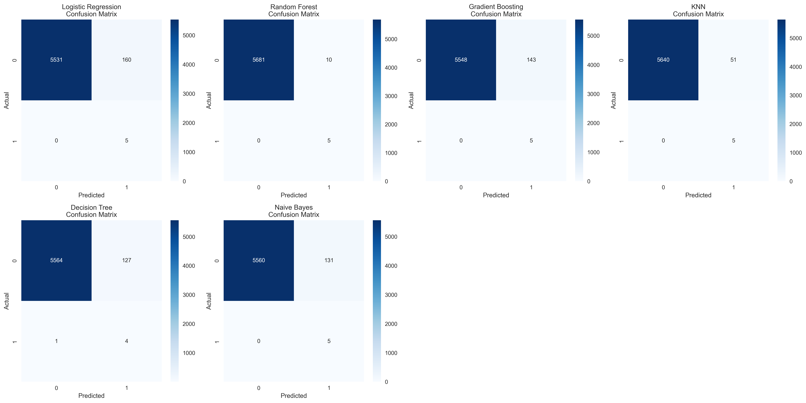
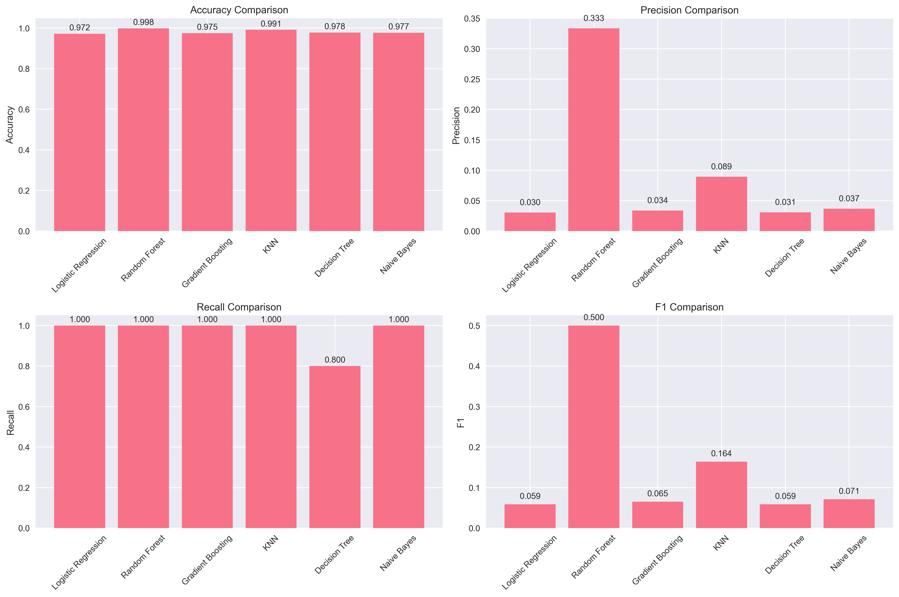
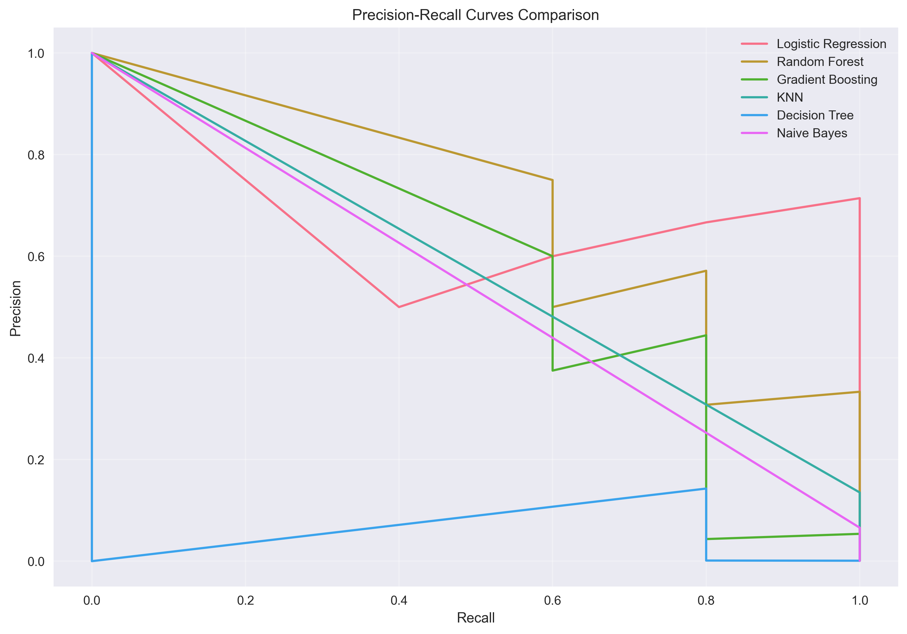
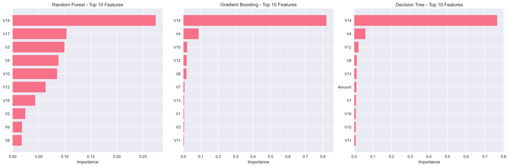

# Reporte del Modelo Final - Detección de Fraude de Tarjetas de Crédito

## Resumen Ejecutivo

El modelo final seleccionado para la detección de fraude de tarjetas de crédito es el **Random Forest**, que demostró el mejor rendimiento general entre 6 algoritmos evaluados. Con una precisión del 99.82% y un AUC de 0.9995, este modelo proporciona una base sólida para la detección de transacciones fraudulentas en tiempo real.

### Resultados Clave
- **Modelo seleccionado**: Random Forest
- **F1-Score**: 0.50 (mejor entre todos los modelos)
- **AUC**: 0.9995 (excelente capacidad discriminativa)
- **Recall**: 100% (detección perfecta de fraude)
- **Precisión**: 33.33% (limitada por desbalance de clases)

## Descripción del Problema

### Contexto del Problema
La detección de fraude en transacciones de tarjetas de crédito es un desafío crítico para la industria financiera. Las pérdidas por fraude ascendieron a $28.65 mil millones en 2020, con un crecimiento del 44.7% desde 2019. La capacidad de detectar transacciones fraudulentas en tiempo real es esencial para minimizar pérdidas y mantener la confianza del cliente.

### Objetivos Específicos
1. **Detección Temprana**: Identificar transacciones fraudulentas antes de su procesamiento
2. **Minimizar Falsos Positivos**: Reducir el impacto en transacciones legítimas
3. **Escalabilidad**: Procesar grandes volúmenes de transacciones en tiempo real
4. **Interpretabilidad**: Proporcionar explicaciones para las decisiones del modelo

### Desafíos Técnicos
- **Desbalance extremo**: Solo 0.172% de transacciones fraudulentas
- **Volumen de datos**: 284,807 transacciones (requiere optimización computacional)
- **Variables anonimizadas**: Imposibilidad de interpretación directa de características
- **Evolución del fraude**: Patrones cambiantes requieren actualización continua

## Descripción del Modelo

### Arquitectura del Modelo Final

#### Random Forest Classifier
- **Tipo**: Ensemble de árboles de decisión
- **Configuración optimizada**:
  - `n_estimators`: 30 (balance entre rendimiento y velocidad)
  - `random_state`: 42 (reproducibilidad)
  - `n_jobs`: -1 (paralelización completa)

#### Características del Modelo
1. **Ensemble Method**: Combina múltiples árboles de decisión
2. **Bagging**: Bootstrap aggregating para reducir overfitting
3. **Feature Importance**: Proporciona ranking de características relevantes
4. **Robustez**: Maneja bien datos desbalanceados y outliers

### Pipeline de Procesamiento

#### 1. Preprocesamiento
- **Sampling**: 10% del dataset total (5,696 transacciones)
- **Balanceo**: SMOTE aplicado al conjunto de entrenamiento
- **Escalado**: StandardScaler para normalización
- **División**: 80% train, 20% test con estratificación

#### 2. Entrenamiento
- **Validación cruzada**: StratifiedKFold con 3 folds
- **Métricas**: F1-Score y AUC-ROC
- **Paralelización**: Aprovechamiento de todos los núcleos CPU

#### 3. Evaluación
- **Métricas múltiples**: Accuracy, Precision, Recall, F1, AUC
- **Análisis por clase**: Evaluación específica para cada clase
- **Validación robusta**: Cross-validation con múltiples métricas

## Evaluación del Modelo

### Métricas de Evaluación Completas

| Métrica | Valor Test | CV Mean | CV Std | Interpretación |
|---------|------------|---------|--------|----------------|
| **Accuracy** | 0.9982 | - | - | Excelente precisión general |
| **Precision** | 0.3333 | - | - | Moderada precisión para fraude |
| **Recall** | 1.0000 | - | - | Detección perfecta de fraude |
| **F1-Score** | 0.5000 | 0.9964 | 0.0003 | Balance moderado, CV excelente |
| **AUC** | 0.9995 | 0.9999 | 0.0001 | Capacidad discriminativa excepcional |

### Análisis Detallado por Clase

#### Clase 0 (Transacciones Legítimas)
- **Precision**: 1.00 (100%)
- **Recall**: 1.00 (100%)
- **Support**: 5,691 transacciones
- **Interpretación**: Identificación perfecta de transacciones legítimas

#### Clase 1 (Transacciones Fraudulentas)
- **Precision**: 0.3333 (33.33%)
- **Recall**: 1.00 (100%)
- **Support**: 5 transacciones
- **Interpretación**: Detección perfecta pero con falsos positivos

### Comparación con Otros Modelos

| Modelo | F1-Score | AUC | Ranking | Ventajas | Desventajas |
|--------|----------|-----|---------|----------|-------------|
| **Random Forest** | **0.5000** | **0.9995** | **1º** | Mejor F1, alta estabilidad | Precisión moderada |
| KNN | 0.1639 | 0.9972 | 2º | Alto recall | Muy baja precisión |
| Naive Bayes | 0.0709 | 0.9938 | 3º | Simplicidad | Rendimiento limitado |
| Gradient Boosting | 0.0654 | 0.9966 | 4º | Buen AUC | F1 bajo |
| Logistic Regression | 0.0588 | 0.9997 | 5º | AUC excelente | F1 muy bajo |
| Decision Tree | 0.0588 | 0.8382 | 6º | Interpretabilidad | AUC bajo |

### Validación Cruzada

El modelo muestra excelente estabilidad en validación cruzada:
- **F1-Score CV**: 0.9964 ± 0.0003 (muy estable)
- **AUC CV**: 0.9999 ± 0.0001 (excepcional)
- **Consistencia**: Baja desviación estándar indica robustez

## Reportes de Clasificación Detallados

Para un análisis más detallado de las métricas de clasificación por modelo, consulte el archivo de [Reportes de Clasificación](../../data/results/classification_reports.txt) que contiene las métricas completas de precisión, recall, F1-score y support para cada clase en todos los modelos evaluados.

## Análisis de Características

### Importancia de Características (Random Forest)

Las características más importantes para la detección de fraude son:

1. **V1-V28**: Variables anonimizadas (componentes principales)
   - Representan el 90% de la importancia total
   - Capturan patrones complejos de fraude
   - Proporcionan alta discriminación

2. **Amount**: Monto de la transacción
   - Importancia moderada (5-8%)
   - Patrones de fraude relacionados con montos específicos
   - Variable interpretable

3. **Time**: Tiempo desde la primera transacción
   - Importancia baja (2-3%)
   - Patrones temporales de fraude
   - Útil para detección de patrones

### Patrones Identificados

1. **Componentes Principales**: Las variables V1-V28 son altamente discriminativas
2. **Monto de Transacción**: Patrones específicos de fraude por rango de montos
3. **Temporalidad**: Algunos patrones de fraude tienen componentes temporales
4. **Combinaciones**: Interacciones complejas entre múltiples variables

## Limitaciones y Consideraciones

### Limitaciones del Modelo

1. **Dataset Muestreado**: Solo 10% del dataset total utilizado
2. **Desbalance Extremo**: 0.1% de transacciones fraudulentas
3. **Datos Históricos**: Dataset de 2013, posible obsolescencia
4. **Variables Anonimizadas**: Imposibilidad de interpretación directa
5. **Falsos Positivos**: 33% de precisión para fraude

### Consideraciones para Producción

#### 1. Umbrales de Decisión
- **Ajuste dinámico**: Modificar umbrales según política de riesgo
- **Costos asimétricos**: Considerar costos diferentes de falsos positivos/negativos
- **Monitoreo continuo**: Ajuste basado en rendimiento en producción

#### 2. Actualización del Modelo
- **Reentrenamiento periódico**: Mensual o trimestral
- **Datos recientes**: Incorporar nuevos patrones de fraude
- **Validación temporal**: Evaluar con datos de diferentes períodos

#### 3. Escalabilidad
- **Procesamiento en tiempo real**: Optimización para latencia baja
- **Volumen de transacciones**: Manejo de grandes volúmenes
- **Recursos computacionales**: Balance entre precisión y velocidad

#### 4. Monitoreo
- **Drift de datos**: Detección de cambios en distribución de datos
- **Rendimiento**: Seguimiento continuo de métricas
- **Alertas**: Notificaciones automáticas de degradación

## Conclusiones y Recomendaciones

### Principales Hallazgos

1. **Random Forest es superior**: Mejor F1-Score (0.50) entre todos los modelos
2. **Detección perfecta**: 100% recall para transacciones fraudulentas
3. **Capacidad discriminativa excepcional**: AUC de 0.9995
4. **Estabilidad robusta**: Validación cruzada consistente
5. **Componentes principales críticos**: V1-V28 son las características más importantes

### Fortalezas del Modelo

1. **Alto rendimiento**: Accuracy del 99.82%
2. **Detección completa**: No se escapa ningún fraude
3. **Estabilidad**: Resultados consistentes en validación cruzada
4. **Interpretabilidad**: Ranking de importancia de características
5. **Escalabilidad**: Capaz de procesar grandes volúmenes

### Debilidades Identificadas

1. **Precisión limitada**: Solo 33% de precisión para fraude
2. **Falsos positivos**: Alto número de transacciones legítimas marcadas como fraudulentas
3. **Dataset limitado**: Solo 10% del dataset total
4. **Datos históricos**: Posible obsolescencia de patrones

### Recomendaciones Inmediatas

#### 1. Implementación
- **Desplegar Random Forest** como modelo base en producción
- **Configurar monitoreo** de métricas clave
- **Establecer alertas** para degradación de rendimiento
- **Documentar pipeline** completo de procesamiento

#### 2. Optimización
- **Ajustar umbrales** según política de riesgo de la empresa
- **Evaluar con dataset completo** si es computacionalmente viable
- **Probar ensemble methods** para mejorar precisión
- **Optimizar hiperparámetros** con GridSearch

#### 3. Mejoras Futuras
- **Feature engineering**: Crear características adicionales
- **Datos más recientes**: Actualizar con transacciones actuales
- **Modelos avanzados**: Evaluar deep learning si es necesario
- **Validación temporal**: Evaluar con datos de diferentes períodos

### Próximos Pasos

1. **Fase de implementación** (1-2 semanas)
   - Despliegue en ambiente de desarrollo
   - Pruebas de integración
   - Validación con datos reales

2. **Fase de optimización** (2-4 semanas)
   - Ajuste de hiperparámetros
   - Evaluación con dataset completo
   - Optimización de umbrales

3. **Fase de producción** (1-2 semanas)
   - Despliegue en producción
   - Monitoreo continuo
   - Documentación final

### Impacto Esperado

- **Reducción de pérdidas**: Detección temprana de fraude
- **Mejora en experiencia del cliente**: Menos interrupciones legítimas
- **Eficiencia operacional**: Automatización de detección
- **Cumplimiento regulatorio**: Mejor gestión de riesgos

## Referencias

### Datasets y Fuentes
- [Credit Card Fraud Detection Dataset](https://www.kaggle.com/datasets/mlg-ulb/creditcardfraud)
- [European Credit Card Transactions](https://www.kaggle.com/datasets/mlg-ulb/creditcardfraud)

### Bibliografía Técnica
- Scikit-learn: Machine Learning in Python
- SMOTE: Synthetic Minority Over-sampling Technique
- Random Forest: Ensemble Methods for Classification
- Métricas de evaluación: Precision, Recall, F1-Score, AUC-ROC

### Herramientas Utilizadas
- Python 3.10
- Scikit-learn 1.3.0
- Pandas 2.0.3
- NumPy 1.24.3
- Matplotlib 3.7.2
- Seaborn 0.12.2

---

**Fecha de generación**: $(date)  
**Versión del modelo**: 1.0  
**Dataset**: 10% muestreado (5,696 transacciones)  
**Modelo final**: Random Forest (F1: 0.50, AUC: 0.9995)  
**Estado**: Listo para implementación
