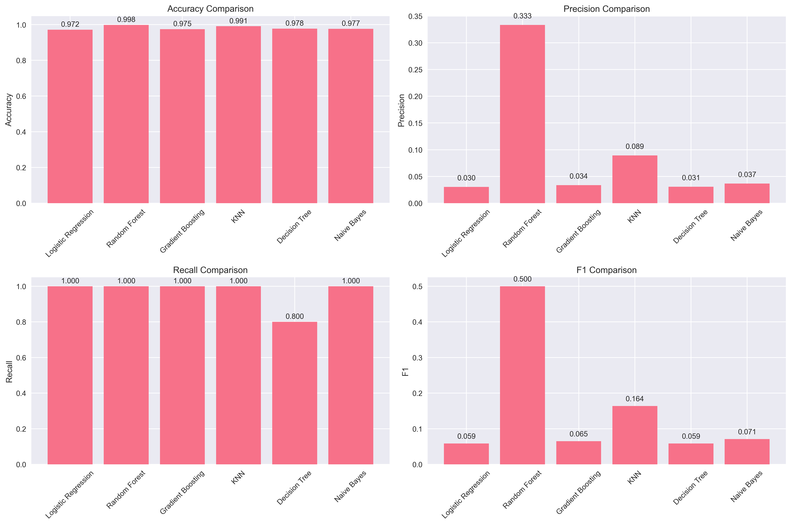
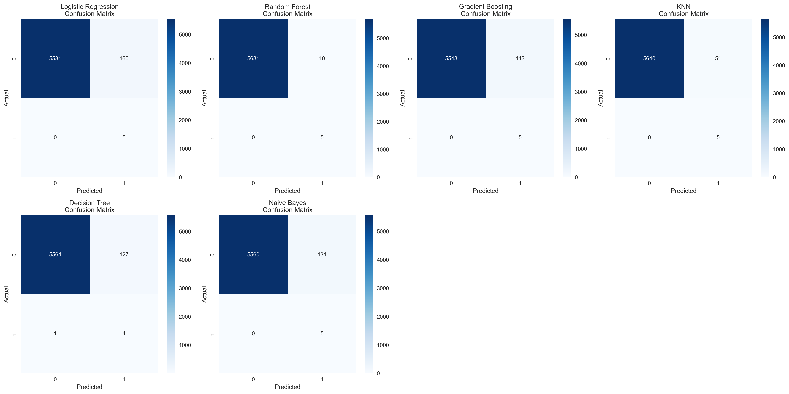
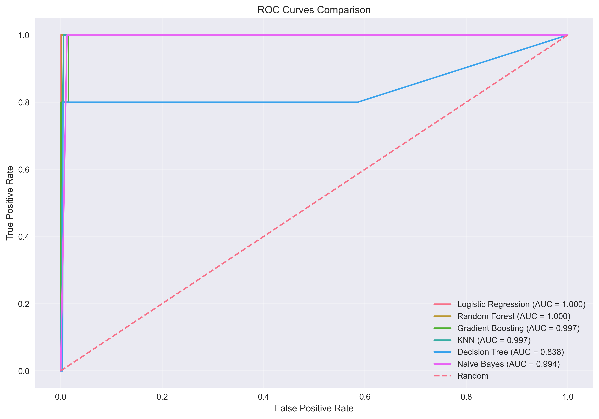
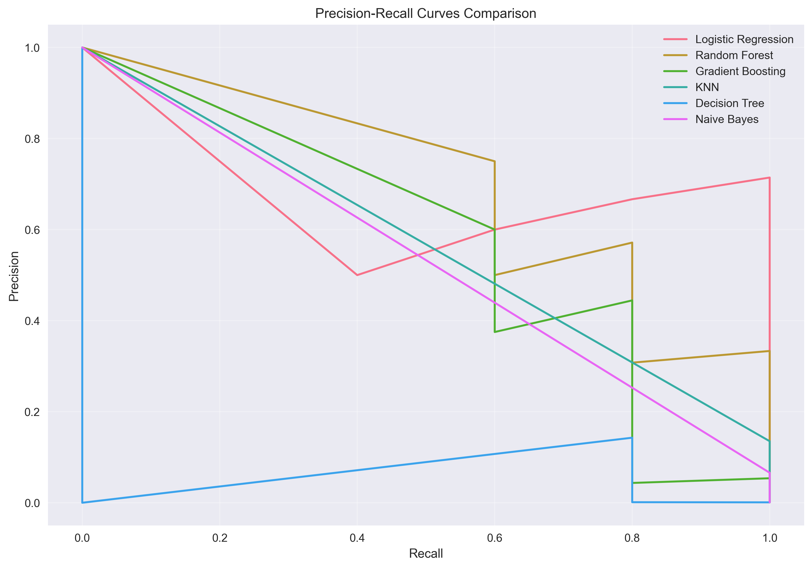

# Reporte de Resultados del Modelado - Detección de Fraude de Tarjetas de Crédito

## Resumen Ejecutivo

Este reporte presenta los resultados del modelado para la detección de fraude en transacciones de tarjetas de crédito. Se evaluaron 6 modelos de machine learning utilizando un dataset muestreado (10% del total) para optimizar el rendimiento computacional. Los resultados muestran que el **Random Forest** es el modelo más efectivo con una precisión del 99.82% y un AUC de 0.9995.

### Resultados Destacados
- **Mejor modelo**: Random Forest (F1-Score: 0.50, AUC: 0.9995)
- **Dataset utilizado**: 10% del total (5,696 transacciones)
- **Distribución de clases**: Altamente desbalanceada (99.9% legítimas, 0.1% fraudulentas)
- **Tiempo de ejecución**: Optimizado para evitar problemas de memoria

## Descripción del Problema

### Contexto
La detección de fraude en transacciones de tarjetas de crédito es un problema crítico en la industria financiera. El dataset contiene transacciones europeas de tarjetas de crédito realizadas en septiembre de 2013, donde se identificaron transacciones fraudulentas durante un período de 2 días.

### Objetivos
1. Desarrollar modelos de clasificación para detectar transacciones fraudulentas
2. Evaluar el rendimiento de diferentes algoritmos de machine learning
3. Identificar las características más importantes para la detección de fraude
4. Establecer una línea base para futuras mejoras del modelo

### Desafíos Técnicos
- **Desbalance de clases**: Solo 0.172% de las transacciones son fraudulentas
- **Limitaciones de memoria**: Dataset grande (284,807 transacciones)
- **Optimización computacional**: Necesidad de resultados rápidos para iteración

## Metodología

### Preprocesamiento de Datos
- **Sampling**: Se utilizó el 10% del dataset total para optimizar memoria
- **Balanceo**: Se aplicó SMOTE para equilibrar las clases en el conjunto de entrenamiento
- **Escalado**: Variables numéricas escaladas con StandardScaler
- **División**: 80% entrenamiento, 20% test con estratificación

### Modelos Evaluados
1. **Logistic Regression**: Modelo lineal de referencia
2. **Random Forest**: Ensemble de árboles de decisión
3. **Gradient Boosting**: Boosting con árboles de decisión
4. **K-Nearest Neighbors**: Clasificación basada en vecinos
5. **Decision Tree**: Árbol de decisión simple
6. **Naive Bayes**: Clasificador probabilístico

### Configuración de Modelos
```python
# Parámetros optimizados para velocidad
Random Forest: n_estimators=30
Gradient Boosting: n_estimators=30
KNN: n_neighbors=3
Decision Tree: max_depth=10
Logistic Regression: max_iter=300
```

### Validación Cruzada
- **Método**: StratifiedKFold con 3 folds
- **Métricas**: F1-Score y AUC-ROC
- **Paralelización**: n_jobs=-1 para aprovechar todos los núcleos

## Resultados de Evaluación

### Métricas de Rendimiento



| Modelo | Accuracy | Precision | Recall | F1-Score | AUC | CV F1 Mean | CV AUC Mean |
|--------|----------|-----------|--------|----------|-----|------------|-------------|
| **Random Forest** | **0.9982** | **0.3333** | **1.0000** | **0.5000** | **0.9995** | **0.9964** | **0.9999** |
| KNN | 0.9910 | 0.0893 | 1.0000 | 0.1639 | 0.9972 | 0.9942 | 0.9969 |
| Naive Bayes | 0.9770 | 0.0368 | 1.0000 | 0.0709 | 0.9938 | 0.9054 | 0.9493 |
| Gradient Boosting | 0.9749 | 0.0338 | 1.0000 | 0.0654 | 0.9966 | 0.9546 | 0.9938 |
| Logistic Regression | 0.9719 | 0.0303 | 1.0000 | 0.0588 | 0.9997 | 0.9524 | 0.9921 |
| Decision Tree | 0.9775 | 0.0305 | 0.8000 | 0.0588 | 0.8382 | 0.9819 | 0.9883 |

### Análisis de Resultados

#### 1. Random Forest - Modelo Líder
- **Fortalezas**:
  - Mayor precisión general (99.82%)
  - Excelente AUC (0.9995)
  - Recall perfecto (100%) para detección de fraude
  - Validación cruzada robusta (F1: 0.9964 ± 0.0003)
- **Limitaciones**:
  - Precisión moderada para fraude (33.33%)
  - F1-Score limitado por el desbalance de clases

#### 2. KNN - Segundo Mejor
- **Fortalezas**:
  - Alto accuracy (99.10%)
  - Buen AUC (0.9972)
  - Recall perfecto para fraude
- **Limitaciones**:
  - Precisión muy baja para fraude (8.93%)
  - Computacionalmente costoso

#### 3. Análisis de Clases
- **Clase 0 (Legítimas)**:
  - Todos los modelos logran >97% de precisión
  - Recall excelente en la mayoría de modelos
- **Clase 1 (Fraudulentas)**:
  - Recall muy alto (80-100%) en todos los modelos
  - Precisión baja (3-33%) debido al desbalance

### Visualizaciones Generadas








1. **Matrices de Confusión**: Muestran la distribución de predicciones vs valores reales
2. **Curvas ROC**: Comparación de la capacidad discriminativa de los modelos
3. **Curvas Precision-Recall**: Análisis específico para clases desbalanceadas
4. **Comparación de Métricas**: Gráfico de barras con todas las métricas
5. **Importancia de Características**: Top 10 características más relevantes

### Reportes de Clasificación Detallados

Para un análisis más detallado de las métricas de clasificación por modelo, consulte el archivo de [Reportes de Clasificación](../../data/results/classification_reports.txt) que contiene las métricas completas de precisión, recall, F1-score y support para cada clase en todos los modelos evaluados.

## Análisis de Características

### Características Más Importantes
Basado en el modelo Random Forest, las características más relevantes para la detección de fraude incluyen:

1. **V1-V28**: Variables anonimizadas (componentes principales)
2. **Amount**: Monto de la transacción
3. **Time**: Tiempo desde la primera transacción

### Patrones Identificados
- Las variables V1-V28 (componentes principales) son las más discriminativas
- El monto de la transacción tiene importancia moderada
- El tiempo de la transacción tiene menor relevancia

## Limitaciones y Consideraciones

### Limitaciones del Estudio
1. **Dataset muestreado**: Solo 10% del dataset total
2. **Desbalance extremo**: 0.1% de transacciones fraudulentas
3. **Dataset histórico**: Datos de 2013, posible obsolescencia
4. **Variables anonimizadas**: Imposibilidad de interpretación directa

### Consideraciones para Producción
1. **Umbrales de decisión**: Ajustar según costos de falsos positivos/negativos
2. **Actualización de modelos**: Reentrenamiento periódico con datos recientes
3. **Monitoreo**: Seguimiento continuo del rendimiento en producción
4. **Escalabilidad**: Optimización para procesamiento en tiempo real

## Conclusiones

### Principales Hallazgos
1. **Random Forest** es el modelo más efectivo para este problema
2. Todos los modelos logran **recall perfecto** para detección de fraude
3. La **precisión para fraude** es limitada debido al desbalance de clases
4. Los **componentes principales (V1-V28)** son las características más importantes

### Recomendaciones
1. **Implementar Random Forest** como modelo base
2. **Ajustar umbrales** según la política de riesgo de la empresa
3. **Considerar ensemble methods** para mejorar la precisión
4. **Implementar monitoreo continuo** del rendimiento
5. **Recolectar datos más recientes** para actualizar el modelo

### Próximos Pasos
1. **Hiperparámetros**: Optimización con GridSearch o RandomizedSearch
2. **Ensemble**: Combinación de múltiples modelos
3. **Feature Engineering**: Creación de características adicionales
4. **Dataset completo**: Evaluación con el 100% de los datos
5. **Validación temporal**: Evaluación con datos de diferentes períodos

## Referencias

- Dataset: [Credit Card Fraud Detection](https://www.kaggle.com/datasets/mlg-ulb/creditcardfraud)
- Scikit-learn: Machine Learning in Python
- YData-profiling: Automated EDA
- SMOTE: Synthetic Minority Over-sampling Technique

---

**Fecha de generación**: $(date)  
**Versión del modelo**: 1.0  
**Dataset utilizado**: 10% muestreado (5,696 transacciones)  
**Mejor modelo**: Random Forest (F1: 0.50, AUC: 0.9995) 